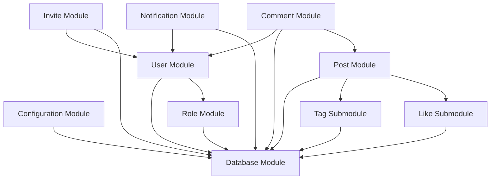
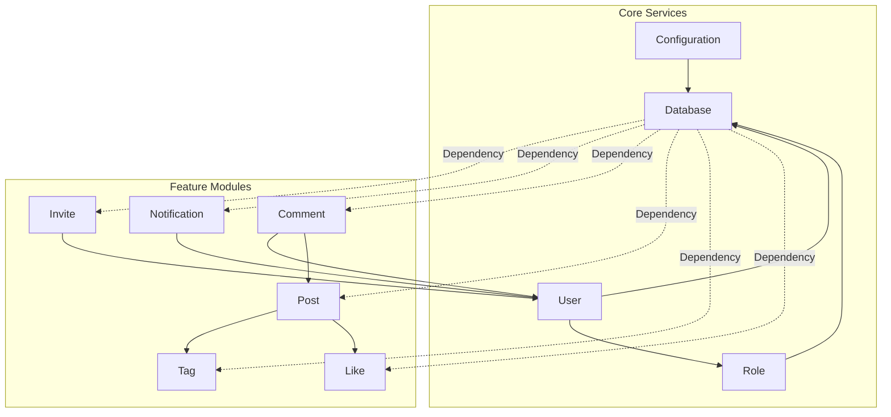
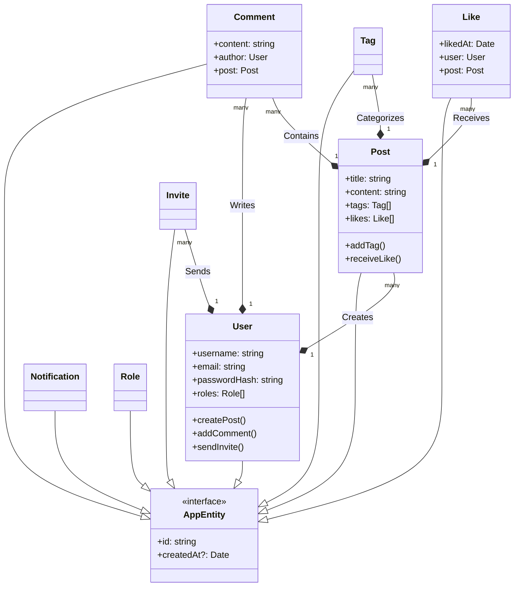



### 1️⃣ **Project Structure in Nx**
#### 🛠️ **Apps & Libs Organization:**

- **Apps:** Create a dedicated Nest.js app (e.g., `apps/api`) for the backend.
- **Libs:** Organize shared code (e.g., DTOs, interfaces, utilities, custom decorators, guards, and middleware) into libraries. This makes it easier to reuse code across modules and even across frontend apps if needed.

#### 🏗️ **Domain-Driven Design:**

- Break down the backend into domain-specific modules (e.g., `AuthModule`, `UsersModule`, `PostsModule`) to maintain a clear separation of concerns.

---

### 2️⃣ **Core Modules & Their Responsibilities**
#### 🔑 **Auth Module**
##### 🚀 **Endpoints:**
- `/auth/register` – Secure user registration (with email verification token generation).
- `/auth/verify-email` – Endpoint for email confirmation.
- `/auth/login` – Authenticate user credentials using Passport (Local Strategy) and issue JWT tokens.
- `/auth/logout` – Invalidate the current session or JWT (if using token blacklisting).
- `/auth/forgot-password` & `/auth/reset-password` – Handle password recovery with time-limited reset tokens.

##### 🛡️ **Best Practices:**
- **Validation:** Use DTOs with class-validator to validate incoming data.
- **Security:** Integrate rate limiting (e.g., with the Nest Throttler) to mitigate brute-force attacks.

##### 💼 **Session Management:**
- Consider using JWTs for stateless auth or sessions stored in a Redis cache if you need server-managed sessions with timeouts.
- For multi-factor authentication, you might integrate a TOTP (Time-based One-Time Password) solution later.

---

#### 👤 **Users Module**
##### 📝 **Responsibilities:**
- Manage user profiles, including profile updates and possibly user invitation handling for a closed group.
- Support role-based access control (RBAC) if you later need to differentiate permissions beyond simple authentication.

##### ⚙️ **Best Practices:**
- Use guards (e.g., `@UseGuards(JwtAuthGuard)`) to protect endpoints.
- Separate profile management logic from authentication logic for cleaner code.

---

#### 📝 **Posts Module**
##### ✍️ **Responsibilities:**
- CRUD operations for blog posts (create, read, update, delete).
- Implement pagination (or infinite scroll) for fetching posts.
- Enforce that only authenticated users can create or modify posts.
- (Optional) Incorporate audit trails by logging key actions (post creation, updates, deletions).

##### ⚙️ **Best Practices:**
- **DTOs & Validation:** Each operation (create, update) should have dedicated DTOs for strong typing and validation.
- **Pagination:** Use query parameters (e.g., limit, offset) and consider using Nest’s interceptors to standardize response formats.
- **Soft Deletes:** Depending on your requirements, you might implement soft deletes so that accidental removals can be recovered.

##### 🔄 **Optional/Enhanced Modules:**
- **Comments Module:** If you decide to add a commenting feature later, structure it similarly to the Posts module.
- **Notifications Module:** For in-app or email notifications, consider a separate module with support for scheduling and asynchronous processing (using message queues if needed).
- **Search Module:** Enhance your API by integrating a search functionality—either using database full-text search or integrating with a search engine like Elasticsearch for scalability.

---

### 3️⃣ **Infrastructure & Libraries**
#### 🗄️ **Database Integration**
- **Choice:** PostgreSQL is a great choice for relational integrity. Consider using TypeORM or Prisma for ORM. Prisma is known for its type safety and modern developer experience.
- **Migrations:** Use migration tools provided by your ORM to handle schema changes seamlessly.

#### 🔒 **Security Enhancements**
- **HTTPS & Helmet:** Ensure all endpoints enforce HTTPS. Use the Helmet middleware to set secure HTTP headers.
- **Input Sanitization:** Leverage Nest’s built-in pipes along with libraries like class-sanitizer to clean inputs.
- **Rate Limiting:** Integrate the Nest Throttler to protect against brute-force login attempts.
- **Logging & Audit Trails:** Implement a logging strategy (using Nest’s Logger or integrating with Winston). For audit trails, consider an AuditLog entity and/or use interceptors to log critical operations like post updates or deletions.

#### ⚙️ **Global Setup**
- **Validation Pipe:** Set up a global validation pipe (using ValidationPipe) to ensure all incoming requests are validated against your DTOs.
- **Exception Filters:** Create global exception filters to handle errors gracefully and provide consistent error responses.
- **Configuration Module:** Use the `@nestjs/config` package to manage environment variables and configuration settings across modules.

#### 📚 **API Documentation**
- **Swagger:** Integrate Swagger for API documentation. This not only helps frontend developers but also serves as live documentation for your API endpoints.

---

### 4️⃣ **CI/CD, Testing & Deployment**
#### 🧪 **Testing:**
- Use Jest (bundled with Nest.js) for unit and integration tests.
- Structure your tests within the Nx workspace to cover each module.

#### 🔄 **CI/CD Pipelines:**
- Configure pipelines to run tests, linting, and build processes automatically.
- Consider Dockerizing the application for consistent deployment across environments.

#### 🚀 **Scalability:**
- Design your Nest.js app with scalability in mind. Even if you start as a monolith, having well-defined modules allows you to later extract microservices if needed.

#### ⚡ **Caching:**
- For performance enhancements, especially on frequently accessed endpoints (like the blog feed), integrate caching mechanisms (using Redis and the Nest Cache module).

---

### 5️⃣ **Enhancements & Future-Proofing**
#### 🔮 **GraphQL Option:**
- While the current requirements lean toward RESTful APIs, designing your modules with separation of business logic (services) from controllers will make it easier to later expose a GraphQL endpoint if desired.

#### 🏘️ **Multi-Tenancy / Invitations:**
- The invite system for a closed group can be implemented in the Users module. You might store invitation tokens and enforce validations during registration.

#### 💬 **Real-Time Features:**
- If in the future you add real-time notifications or comment updates, consider using WebSockets with Nest’s built-in support.

---

### 📜 **Summary**
The proposed Nest.js backend architecture will consist of clearly defined modules (Auth, Users, Posts, and optional ones), each responsible for a specific domain. Leveraging Nx’s monorepo capabilities ensures that shared code is reusable and maintainable across your Nest.js backend and frontend apps. Security, validation, logging, and scalability are all integrated using industry best practices and widely adopted Nest.js patterns.


---

## 💯 Architecture & Design Documentation


This structure keeps each module's responsibilities isolated and helps prevent circular dependencies by using clear, shared interfaces between modules. 🔄

## Top-level vue

Below is an updated diagram that explicitly shows the relationships—including the Database module dependency for each module—to help you anticipate circular dependencies and overall complexity: 📊



### 📖 Explanation

- **Configuration Module:**  
  Provides application settings, which the **Database Module** relies on.

- **Database Module:**  
  Acts as a centralized service for all data persistence. Every module that performs DB operations (User, Role, Invite, Notification, Comment, Post, Tag, Like) depends on it. 💾

- **Core Modules (User & Role):**
  - **User Module** handles user data and depends on both **Database** and **Role Module**.
  - **Role Module** manages roles (e.g., Admin, Member) and also relies on **Database**. 🔑

- **Feature Modules:**
  - **Invite Module** and **Notification Module** both depend on the **User Module** and use **Database** for persistence. 📩
  - **Comment Module** depends on both **User** and **Post Modules** (with DB operations handled via **Database Module**).
  - **Post Module** is responsible for blog posts and incorporates two submodules:
    - **Tag Submodule**
    - **Like Submodule**   
      Both submodules also depend on the **Database Module**.


---

This explicit structure helps plan ahead for managing dependencies, complexity, and avoids circular references by ensuring every module interacts with shared services (like Database) through well-defined interfaces. 🛠️

### 📐 Design decition based on Interfaces

"Now that this is much clearer. I think I would create a super type in the type definition called `appEntity`. It would be an empty interface, and all other interfaces, like `invite`, `notification`, `comment`, etc., would implement it at the first level. Then, each interface would define its own specific set of properties and attributes. This way, I can use `appEntity` to create an abstraction layer over the database by having an abstract class that handles all the CRUD operations in a generic way. Since all other entities implement `appEntity`, each entity can define its own specific operations while avoiding code duplication." 💡

---

## 💬 1. Module Architecture
A layered modular structure ensures separation of concerns and prevents circular dependencies through clearly defined interfaces.



### 1.1 Module Descriptions
| Module          | Responsibility                              | Dependencies              |
|-----------------|---------------------------------------------|---------------------------|
| **Configuration** | Centralized app settings management         | None                      |
| **Database**      | Data persistence layer                      | Configuration             |
| **User**          | User authentication & profile management    | Database, Role            |
| **Role**          | Role-based access control (Admin/Member)    | Database                  |
| **Invite**        | User invitation system                      | Database, User            |
| **Notification**  | Real-time user notifications                | Database, User            |
| **Post**          | Blog post management                        | Database, Tag, Like       |
| **Comment**       | Post commenting system                      | Database, User, Post      |

---

## 2. Entity Interface Design
A polymorphic interface pattern enables type-safe generic operations while maintaining entity-specific flexibility.

### 2.1 Base Interface
```typescript
/**
 * Base entity contract for all domain objects
 * @interface AppEntity
 */
export interface AppEntity {
  id: string;
  createdAt?: Date; 
}
```

### 👤 2.2 Entity Implementations
```typescript
// User Management
export interface User extends AppEntity {
  username: string;
  email: string;
  passwordHash: string;
  roles: Role[];
}

export interface Role extends AppEntity {
  roleName: string;
}

// Content System
export interface Post extends AppEntity {
  authorId: string;
  title: string;
  content: string;
  tags: Tag[];
  likes: Like[];
}

export interface Comment extends AppEntity {
  postId: string;
  authorId: string;
  content: string;
}

// Engagement Features
export interface Like extends AppEntity {
  userId: string;
  postId: string;
  likedAt: Date;
}

export interface Tag extends AppEntity {
  name: string;
  postCount: number;
}

// Collaboration
export interface Invite extends AppEntity {
  email: string;
  invitedBy: string;
  expiresAt: Date;
  status: 'pending'|'accepted'|'expired';
}

export interface Notification extends AppEntity {
  userId: string;
  message: string;
  isRead: boolean;
  type: 'system'|'user';
}
```

---

## 3. Entity Relationship Diagram
Visualizes domain object interactions and inheritance structure.



### ⚙️ 3.1 Key Relationships
1. **User-Driven Interactions**
  - Authorship of posts and comments
  - Initiation of invites and notifications
  - Engagement through likes

2. **Content Graph**
  - Posts form the root of tags/comments/likes
  - Tags enable cross-content categorization

3. **Temporal Tracking**
  - Automatic `createdAt` via `AppEntity`
  - Explicit timestamps for critical actions (likes, invites)

---

## ❤️ 4. Architectural Benefits
- **Type Safety:** Generic repositories via `AppEntity` enable type-checked CRUD operations
- **Extensibility:** New entities implement base contract without breaking existing code
- **Domain Clarity:** Explicit relationships prevent ambiguous connections between modules
- **Performance:** Clear ownership boundaries enable optimized query patterns

This design serves as both implementation blueprint and long-term documentation for system evolution.
